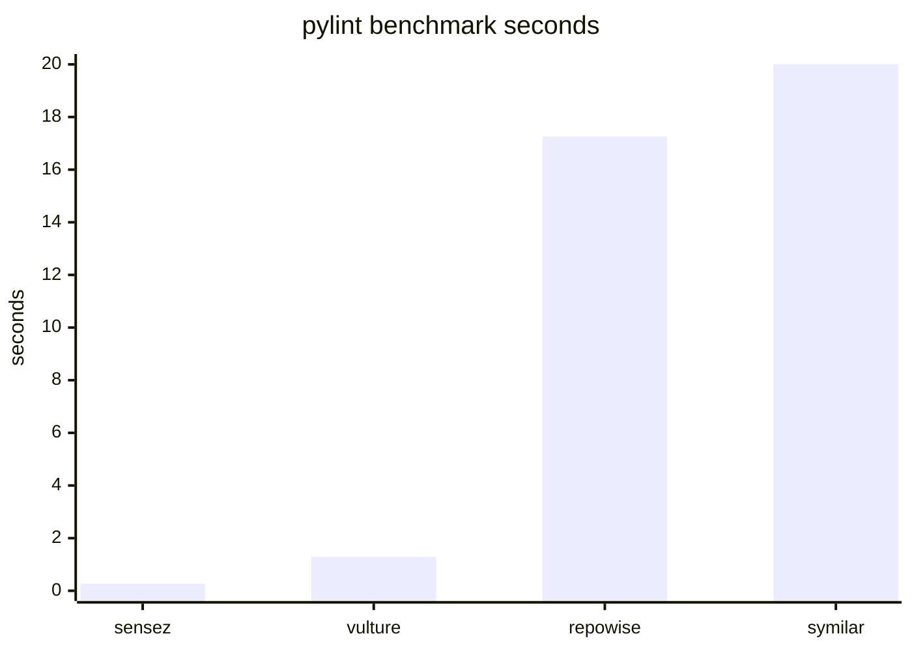
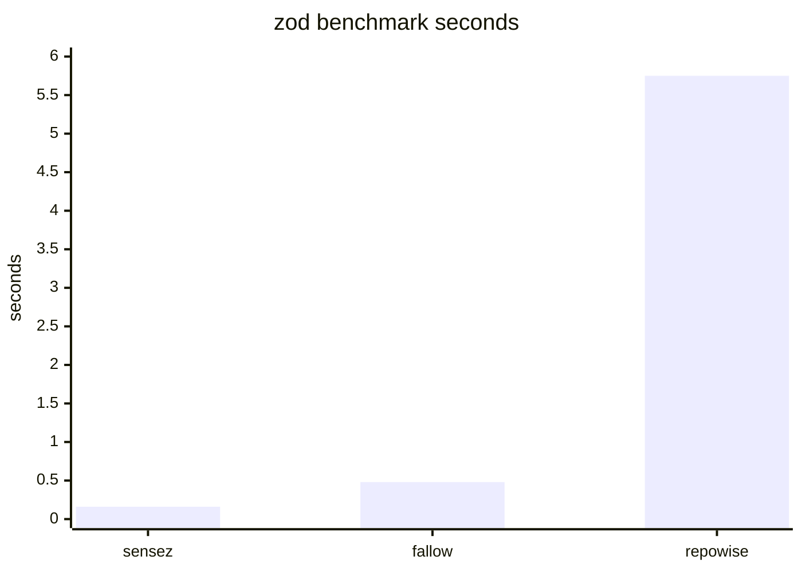

### Why can't coding agents detect code smells? Because they don't have a `noze`.

Coding agents are very good at producing code. They are also very good at
producing the same helper three times, gently ignoring your architecture notes,
and using `dict[str, Any]` when you ask for type safety. You ask it to complete
a task like "a staff software engineer", you ask it to follow SOLID principles
and use strong type safety. It happily agrees, and starts working on the task.
The vibes are immaculate. You come back a few minutes later to a slopocalypse
that looks nothing like what your AGENTS.md says and you spend hours trying to
understand where to start.

Sensez is a suite of Rust CLIs with an MCP server for maintenance before tech debt
accumulates. It runs beside your linter and type-checker and looks for cross-file
problems they usually do not own: duplication, dead code, import cycles, boundary
violations, and design smells. It is designed to give your coding agent the
`noze` to detect code smells, the `bonez` to respect architectural boundaries,
and the `spine` to do it fast.

Supported language profiles currently include Python, JavaScript, TypeScript, and Rust (for dogfooding primarily).

## Quick Start
### Python
```Bash
# Run a one-off scan with uv
uvx --from sensez sense noze .

# Add as a project dev dependency; run it with `uv run sense ...`
uv add --dev sensez
uv run sense init

# Install as a global CLI so `sense ...` works directly
uv tool install sensez
sense init
```

### JS/TS
```Bash
# Add as a dev dependency
npm install --save-dev sensez
# Generate a sensez.toml starter config
npx sensez init . 

# Run a one-off scan with npx
npx sense noze .
```

`sense noze .` is the default scan, but you can also use the verbose method: `sense noze sniff .`


## Performance Snapshot



`sensez` scans all structural pillars in one pass (`0.27s`). `vulture` checks
Python dead code (`1.29s`). `repowise` uses a custom ranking mechanism, including dead code (`17.26s`).
`symilar` checks line-based duplication (`234.12s`; chart capped at `20s`).

### JS/TS



`sensez` scans all structural pillars in one pass (`0.16s`). `fallow` checks
JS/TS structural dead-code and dependency findings (`0.48s`). `repowise` checks
repo intelligence signals, including dead code (`5.75s`).

`sensez` tries to lower dead code noise and allows for configuration of what gets reported. It also includes a few more Python and TS/JS opinionated smells, apart from overall structural consistency metrics.

## The Problem

Coding agents drift. Not due to bad intentions, but because their loop is leaky.

1. Context rots.
   You told the agent to respect boundaries, follow SOLID, and think like a
   staff engineer. Six turns later, the context has been summarized twice and
   the agent is confidently rewriting the same csv file parser your colleague
   wrote two weeks ago.

2. CI is too late.
   CI is great at saying "absolutely not." It is much worse at saying "hm, this
   duplication is small but suspicious." Non-blocking warnings have a natural
   habitat: ignored forever.

3. Slow checks do not fit the turn.
   If a check takes minutes, it should not run every agent turn. If it does not
   run every turn, the slop has time to ferment.
```text
[Agent Proposes Turn Finish] ──> [ 👃 Sensez MCP Sniff ] ──> [ Catches Import Cycle / Duplication ]
                                   │
                                   └──> (Immediate Agent Feedback: "Loose typing violation on line 40 of code.py. Replace loose collections with dataclass/model.")
```

Sensez provides short, structured feedback directly to the agent while the edit is still fresh. Less archaeology, more "fix it before it becomes load-bearing."

## noze

`noze` takes care of the gorgonzola coding agents love so much:

| Area | Output key | What it catches |
|---|---|---|
| Duplication | `duplication` | Structural clones, including local rename copies. |
| Dead code | `dead_code` | Unreferenced symbols with confidence tiers. |
| Cycles | `cycles` | Import loops and load-order tangles. |
| Boundaries | `boundaries` | Imports crossing configured architecture rules. |
| Smells | `smells` | Design pressure inside functions, classes, modules, and the graph. |

Some smell examples:

| Smell | Why noze flags it |
|---|---|
| `tuple_packing` | Positional tuples hide meaning. `tuple[int, str, int]` is not a data model. |
| `loose_typing` | `Any` and vague containers erase the contract callers need. |
| `boolean_blindness` | `do_thing(True, False)` is a guessing game with arguments. |
| `implicit_schema` | Repeated string-key access usually means a real shape is hiding in a dict. |
| `mutated_parameter` | You pass a parameter and the function you sent it to returns it all chewed up. Disgusting. |
| `feature_envy` | A method that mostly uses another object's data may belong somewhere else. |
| `message_chain` | Long `a.b.c.d` chains couple callers to deep object plumbing. |
| `god_module` | One module has become the place everything depends on. |
| `magic_string_default` | Trying to lie to the type checker by adding an `\|\| ""` or `or ""` to hide a string that should be required. |
| `split_variable` | Multiple reassignments of the same variable within the same scope. Set to 1 to keep them constant within the scope and enforce helper functions for complex assignment logic. |
| `nested_loops` | [BETA, can be noisy] Nested iterations may blow up exponentially if not handled properly |
| `n_plus_one_call` | [BETA, can be noisy] Making external calls 1 by 1 (e.g. to a database) instead of using a batched approach. |


`noze` is not a formatter, linter, or type-checker. Keep using Ruff, ty, mypy,
ESLint, TypeScript, rustc, and Clippy. `noze` sits next to them and watches the
repo-level shape.

## MCP

MCP is the default integration path for agents. Use it when Sensez should run
repeatedly during a coding session instead of shelling out for one-off scans.

```bash
sense mcp serve
```

The MCP tools are themed but explicit:

| Tool | Use |
|---|---|
| `noze_sniff` | Scan the repo for smells and structure issues. |
| `noze_gate` | End-of-turn diff gate for agent hooks; experimental and can be noisy on short/Q&A turns. |
| `noze_explain` | Explain a finding category. |
| `brainz_report` | Summarize local usage and resolution metrics. |
| `brainz_triage` | Record user-approved debt or false-positive verdicts. |
| `eyez_search_docs` | [disabled] Search docstrings/comments when `eyez` is enabled. |

You can also use the `smell noze` CLI standalone in GitHub actions. 

## brainz

`brainz` is local-only memory. It records scans, gate blocks, triage decisions,
resolved findings, regressions, detector precision, and usage reports.

Everything stays under:

```text
.sensez/local-metrics/
```

No telemetry. No source upload. Disable it per repo:

```toml
[self_improvement]
enabled = false
```

## Configuration

Sensez reads `sensez.toml` from the project root, or `[tool.sensez]` from
`pyproject.toml` when `sensez.toml` is absent.

```bash
sense init . --yes
```

Main knobs:

- `[duplication]` for clone thresholds
- `[dead_code]` for dynamic entrypoints
- `[smells]` for smell toggles and thresholds
- `[[boundaries.forbidden]]` for architecture contracts
- `[action]` for how strongly agents/gates treat each pillar
- `[accept]` for shared accepted findings
- `[self_improvement]` for local metrics

Small example:

```toml
[duplication]
threshold = 50

[dead_code]
entrypoint_names = ["register", "main", "setup"]

[[boundaries.forbidden]]
from = "app.domain"
to = "app.web"

[smells.rules.long_function]
max_lines = 80
action = "warning"
```

That boundary rule says: domain code does not import web code. If it does, the
import has chosen drama.

## eyez

`eyez` is optional doc/comment search for first-pass orientation:

```bash
sense eyez search . "where do we compute prices?"
```

It is a lead finder, not a complete code search.

## Project Anatomy

- `spine`: file discovery, parsing, shared IR, and dependency graph.
- `profiles`: language adapters for Python, JS/TS, TSX, and Rust.
- `noze`: duplication, dead code, cycles, and design smells.
- `bonez`: architecture boundary auditing.
- `brainz`: local-only metrics and feedback memory.
- `eyez`: optional doc/comment search.
- `mcp`: JSON-RPC/MCP surface for agent integration.
- `reporter`: terminal and JSON output.
- `setup`: `sense init`, starter config, MCP registration, and hook setup.

## Privacy

Sensez does not send telemetry or source code anywhere. Local metrics stay under
`.sensez/local-metrics/`. The optional `eyez` feature downloads an embedding
model from HuggingFace the first time it is used; after that, indexing and search are local.
